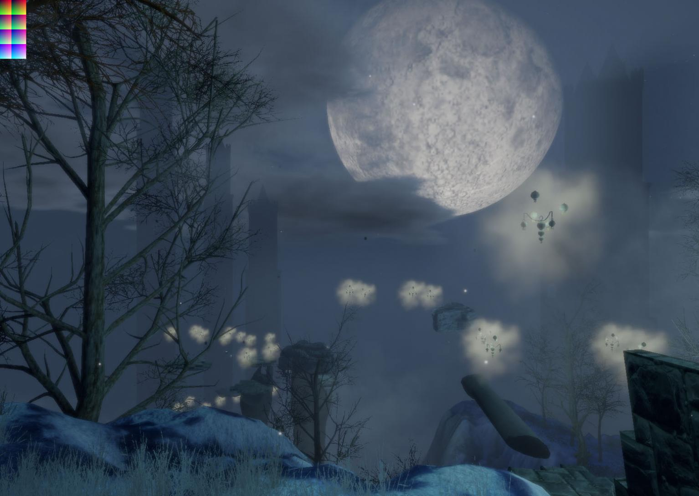

Alche[me]
=========

Spelled with an emphasis on **The Self**, Alchemy represents the duality of human nature, forcing the player to face his subconscious.

Just as the Alchemists were striving for the formula that would turn Lead (the most base of metals) into Gold (the purest and most coveted), you must face your inner-self.

Alche[me] requires you to delve into your dark subconscious in order to transmute your conscious self.

You must face:

  - Your Fear with Courage
  - Your Ego with Selflessness
  - Your Belief with a demonstration of Faith

We are proud to present to you: Alche[me]

---

This is [our entry in the Global Game Jam 2016](http://globalgamejam.org/2016/games/alcheme).

#### The concept

Following the theme (**Ritual**) it was agreed the game will be constructed in a Medieval world with a first-person perspective.
The player's single goal is to reconstruct a stone artifact (which symbolizes "the self").  The pieces that must be retrieved and brought to accomplish this exist within the dark regions of the subconscious.
Time spent in this underworld continuously depletes the player's 'will' (health).  If this level reaches zero the player dies and the game has ended.

Once the ritual is complete (the artifact has been reconstructed) there is a redemption that takes place.  The 'secret' that must be gleaned by the player is that this requires an ultimate self-sacrifice.

---

Participants:

  - Daniel Davis
  - Matt Parkin
  - Thom Parkin
  - John Diasparra
  - Fred Gohsman
